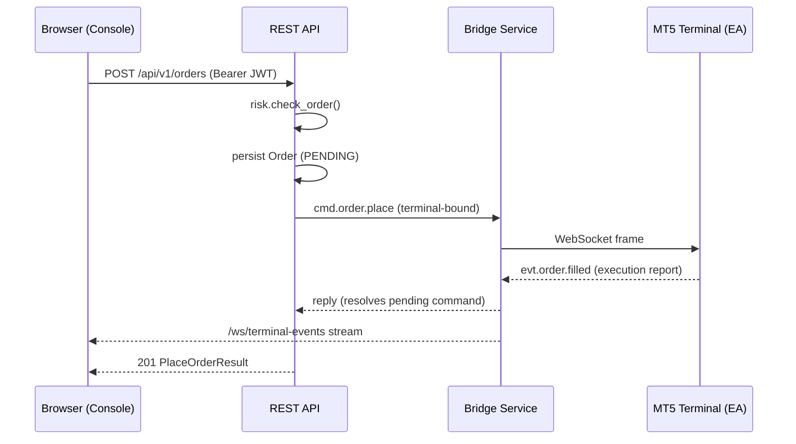

<div align="center">

# ATLAS

### Enterprise AI-powered algorithmic trading platform

**Multi-tenant · MT5-native · AI-driven · pluggable execution adapters**

[](https://github.com/kibuchi254/trading-platform/actions/workflows/ci.yml)
[](https://github.com/kibuchi254/trading-platform/actions/workflows/release.yml)
[](https://www.python.org/)
[](https://nextjs.org/)
[](https://fastapi.tiangolo.com/)
[](https://www.postgresql.org/)
[](#license)
[](#)

</div>

---

ATLAS is a production-grade algorithmic trading platform that treats MetaTrader 5 as **just
one of many possible execution adapters**. The backend is the brain; the AI modules are the
analysts; the strategy engine is the decision-maker; the risk engine is the guardian; the
MT5 Bridge is the messenger; and remote MT5 terminals (running on tenant PCs or Windows VPS)
act as execution adapters over secure WebSockets. A Next.js + shadcn admin console gives you full visual control of every domain.

> **Status:** Core vertical slice shipped — terminal register → heartbeat → place order →
> execution report → position sync — plus a full admin console and 17 management dashboards.
> The complete design lives in [`docs/`](docs/).

---

## ✨ Highlights

- **Pluggable execution** — `ExecutionAdapter` ABC. MT5 and Paper ship built-in; FIX, crypto
  exchanges, and more are drop-in plugins. Adding a broker is a plugin change, not a platform change.
- **The Wine rule** — the backend never shells out to `wine` or `mt5.exe`. All MT5 access flows
  through a **versioned JSON protocol** over WebSocket, carried by a separate Bridge service.
- **Multi-tenant by construction** — every table carries `org_id`; every query path is scoped by
  the authenticated user's organization. JWT **and** API-key auth, role-based access.
- **AI-native** — a fan-in orchestrator composes specialized analyst modules (trend, volatility,
  pattern, sentiment, portfolio, position-sizing, anomaly) into a single composite signal.
- **Pluggable strategies & risk** — strategies are pure `(market_data, ctx) → Signal` functions;
  the risk engine gates every order through an independent rule pack with a global kill switch.
- **Live everywhere** — a two-tier event bus (in-process asyncio + Redis pubsub) fans ticks,
  execution reports, and terminal events to the console in real time over WebSockets.
- **Observable** — structlog JSON logging, OpenTelemetry traces, Prometheus metrics, and
  Grafana dashboards out of the box.
- **Battle-tested CI/CD** — multi-arch Docker images to GHCR, semantic-release, SSH deploy with
  health checks and automatic rollback, plus PR safety guards (migration/test pairing, risk-module
  coverage enforcement).

---

## 🏛 Architecture

```
                         ┌─────────────────────────────────────────────┐
                         │                   nginx                       │
                         │   /  → frontend   /api  /ws  /bridge          │
                         └───┬───────────┬──────────────┬───────────────┘
                             │           │              │
            ┌────────────────▼──┐   ┌─────▼─────┐  ┌─────▼─────┐
            │  ATLAS Console   │   │  REST API │  │  Bridge    │
            │  Next.js 16 +   │   │  FastAPI  │  │  WS server │
            │  shadcn / bun   │   │  :8000    │  │  :9000     │
            └────────────────┬──┘   └─────┬─────┘  └─────▲─────┘
                           API │        │               │ versioned JSON
                  + WS (?token=)│       │               │ over WebSocket
                               │        │               │
                               │   ┌────▼────────────────▼────┐
                               │   │   Application (CQRS)      │
                               │   │   commands / queries      │
                               │   └────┬───────────────┬──────┘
                               │        │               │
                               │   ┌────▼────┐   ┌──────▼──────┐
                               │   │ Domain  │   │ Risk engine │ ← kill switch
                               │   │ (pure)  │   │ + rule pack  │
                               │   └────┬────┘   └─────────────┘
                               │        │
                               │   ┌────▼────────────────────────┐
                               │   │  Infrastructure             │
                               │   │  PostgreSQL · Redis · Celery │
                               │   │  mt5_bridge · adapters      │
                               │   └─────────────────────────────┘
                               │
                               │        Event bus (in-process + Redis pubsub)
                               └────────────────────────────────────────────►
```



---

## 🧱 Tech stack

| Layer | Technology |
|---|---|
| **Backend** | Python 3.13, FastAPI, SQLAlchemy 2.0 (async), asyncpg, Alembic, Pydantic v2 |
| **Realtime** | `websockets`, Redis pubsub, two-tier event bus |
| **Workers** | Celery + Beat, Flower |
| **AI / ML** | scikit-learn, XGBoost, ONNX Runtime, NumPy/Pandas, pluggable LLM assistant |
| **Security** | passlib[bcrypt], PyJWT, API keys (hashed), RBAC |
| **Observability** | structlog, OpenTelemetry, Prometheus, Grafana |
| **Frontend** | Next.js 16 (App Router), React 19, Tailwind v4, shadcn UI, Recharts, TanStack Table, Zustand, **bun** |
| **Infra** | Docker Compose, Kubernetes manifests, nginx, PostgreSQL 16, Redis 7 |

---

## 🚀 Quick start

### Prerequisites

- **Python 3.13+**, **[uv](https://github.com/astral-sh/uv)**, **[bun](https://bun.sh)** ≥ 1.3
- Docker + Docker Compose (for PostgreSQL, Redis, Flower)

### 1 — Backend

```bash
# install deps
uv venv --python 3.13 && uv pip install -e ".[dev]"

# configure
cp .env.example .env          # set SECRET_KEY + BRIDGE_AUTH_TOKEN to random strings

# start infra + migrate
docker compose -f docker/docker-compose.yml up -d postgres redis
alembic upgrade head

# run the three backend processes (separate terminals)
uvicorn platform.main:app --reload --port 8000          # REST API + WS
python -m platform.bridge.server --port 9000            # MT5 Bridge
celery -A platform.infrastructure.celery_app worker -l info
```

### 2 — Frontend (admin console)

```bash
cd frontend
cp .env.example .env.local     # adjust if backend isn't on localhost:8000
bun install
bun run dev                    # http://localhost:3000
```

Open `http://localhost:3000/auth/v1/register` to create your org + first admin, or
`/auth/v1/login` if you already have an account.

### 3 — Attach an MT5 terminal

Attach the EA (`mql5/BridgeEA.mq5`) in MetaTrader 5 (under Wine) and set its inputs
(`InpBridgeUrl`, `InpTerminalId`, `InpBroker`, `InpAuthToken` matching `BRIDGE_AUTH_TOKEN`).
See [`mql5/`](mql5/) and [`docs/DEPLOYMENT.md`](docs/DEPLOYMENT.md).

---

## 📁 Repository layout

```
src/platform/
  core/                config, logging, security, telemetry, exceptions
  db/                  SQLAlchemy 2.0 async session + ORM models
  domain/              DDD entities, value objects, aggregates, domain events
  application/         CQRS commands / queries / handlers (use cases)
  infrastructure/
    redis/             pubsub, cache, distributed locks
    celery_app.py      background workers
    mt5_bridge/        bridge client, protocol, terminal registry, command queue
    execution/         execution-adapter abstraction (mt5, paper, …)
    repositories/      async repositories per aggregate
  api/
    v1/                REST routers (auth, terminals, strategies, orders, positions,
                      trades, signals, backtests, risk, ai, analytics, market-data,
                      notifications, brokers, users, audit)
    ws/                WebSocket routers (ticks, terminal-events)
  bridge/              MT5 Bridge Service (WS server terminals connect to)
  strategies/          Strategy SDK + built-in strategies (EMA, RSI, SMC, grid, …)
  ai/                  AI module SDK + specialized AIs + orchestrator
  risk/                Risk engine + rule pack + kill switch
  market_data/         tick store, OHLC cache, replay, aggregator
  events/              in-process + Redis event bus
  notifications/       email, telegram, discord, webhook channels
  observability/       prometheus metrics, health checks, readiness, tracing
  backtest/            event-driven backtester + optimizer + report
  plugins/             plugin loader for brokers, strategies, AI modules
frontend/              Next.js + shadcn admin console (bun) — 17 dashboards
mql5/                  BridgeEA.mq5 + atlas_bridge.dll (MT5 ↔ Bridge)
docker/                Dockerfiles + docker-compose
deploy/                single-VM + Kubernetes manifests
monitoring/            prometheus.yml, grafana dashboards, nginx.conf
docs/                  architecture, API, development, deployment, security
scripts/               backup_db.sh, restore_db.sh, dr_drill.sh
tests/                 unit / integration / e2e
```

---

## 🔌 API surface

REST under `/api/v1` (JWT `Authorization: Bearer` **or** `X-API-Key`); WebSockets under
`/ws` (JWT passed as `?token=`). Full reference in [`docs/API.md`](docs/API.md).

| Domain | Endpoints |
|---|---|
| **Auth** | `POST /auth/login` `POST /auth/register` `POST /auth/refresh` `POST /auth/api-keys` `GET /auth/me` |
| **Terminals** | `GET /terminals` `GET /terminals/{id}` `POST /terminals/{id}/{sync-positions,sync-account,flatten}` |
| **Orders** | `GET /orders` `GET /orders/{id}` `POST /orders` `POST /orders/{id}/cancel` |
| **Positions** | `GET /positions` `GET /positions/{id}` `POST /positions/{id}/{close,modify}` |
| **Trades** | `GET /trades` |
| **Signals** | `GET /signals` |
| **Strategies** | `GET /strategies` `GET /strategies/available` `POST /strategies` `POST /strategies/{id}/{activate,deactivate}` |
| **Backtests** | `GET /backtests` `GET /backtests/{id}` `POST /backtests` |
| **Risk** | `GET /risk/kill-switch` `POST /risk/kill-switch/{engage,release}` `GET /risk-events` |
| **AI** | `POST /ai/analyze` `POST /ai/assistant/chat` |
| **Analytics** | `GET /analytics/performance` `GET /analytics/positions/open` |
| **Market data** | `GET /market-data/symbols` `GET /market-data/candles/{symbol}` |
| **Brokers** | `GET /brokers` `POST /brokers` `PATCH /brokers/{id}/deactivate` |
| **Notifications** | `GET /notifications` |
| **Admin** | `GET /admin/status` `GET /admin/users` `POST /admin/users` `PATCH /admin/users/{id}/{activate,deactivate}` `GET /admin/audit-logs` |
| **WebSocket** | `/ws/ticks` `/ws/terminal-events` |

Interactive docs at `http://localhost:8000/docs` (Swagger) and `/redoc`.

---

## 🧪 Testing

```bash
pytest                         # all tests (unit + integration)
pytest tests/unit/             # fast, no services required (fakeredis + sqlite-safe)
pytest --cov=platform          # with coverage
ruff check src/ tests/         # lint
mypy src/platform/             # type-check (strict)
cd frontend && bun run check   # biome lint/format for the console
cd frontend && bun run build    # type-check + production build
```

The suite is **285+ unit tests** with 68% coverage and growing. CI runs unit + integration
tests against real PostgreSQL 16 and Redis 7 service containers.

---

## 🚢 Deployment

- **Local dev** — `docker compose -f docker/docker-compose.yml up -d postgres redis` + the
  processes above.
- **Single-VM production** — Docker Compose (`docker/docker-compose.yml`) with nginx, api,
  bridge, worker, flower, postgres, redis, prometheus, grafana, and frontend. See
  [`docs/DEPLOYMENT.md`](docs/DEPLOYMENT.md).
- **Kubernetes** — manifests under `deploy/kubernetes/` (api HPA + PDB, bridge StatefulSet
  with sticky sessions, ingress with TLS + WS routing).
- **CI/CD** — `.github/workflows/`: `ci.yml` (lint, mypy, tests, security, multi-arch image
  build to GHCR), `release.yml` (Conventional Commits → semantic-release), `cd.yml` (SSH deploy
  with health check + automatic rollback), `pr-checks.yml` (auto-label, size check, migration
  guard, dependency diff).

---

## 🗺 Roadmap

- [ ] ONNX-backed AI modules (currently heuristic) + persisted `ai_results` history
- [ ] TimescaleDB hypertable for `ticks`/`candles` at scale
- [ ] Bridge sharding by `terminal_id` hash for HA multi-node
- [ ] FIX 4.4 / 5.0 and crypto-exchange execution adapters
- [ ] Strategy builder UI in the console
- [ ] Multi-region DR with async streaming replication

---

## 📚 Documentation

| Doc | What's in it |
|---|---|
| [docs/ARCHITECTURE.md](docs/ARCHITECTURE.md) | Layering, the Bridge indirection, event bus, adapters, multi-tenancy, data model |
| [docs/API.md](docs/API.md) | Full REST + WebSocket endpoint reference with payloads |
| [docs/DEVELOPMENT.md](docs/DEVELOPMENT.md) | Local setup, testing, migrations, project conventions |
| [docs/DEPLOYMENT.md](docs/DEPLOYMENT.md) | Local, single-VM, Kubernetes, backups, DR, monitoring |
| [docs/SECURITY.md](docs/SECURITY.md) | Trust model, auth, secrets, responsible disclosure |
| [CONTRIBUTING.md](CONTRIBUTING.md) | Dev setup, architecture rules, PR process, review checklist |
| [docs/ATLAS-Architecture.pdf](docs/ATLAS-Architecture.pdf) | The original design document |

---

## 🤝 Contributing

We use [Conventional Commits](https://www.conventionalcommits.org/) (`feat:`, `fix:`,
`chore:` …) — they drive semantic-release. Before opening a PR:

1. `ruff check src/ tests/` and `ruff format --check src/ tests/`
2. `mypy src/platform/`
3. `pytest`
4. `cd frontend && bun run check && bun run build`
5. Open a PR using the [template](.github/pull_request_template.md)

CI enforces: lint, type-check, unit tests, security scan, **migration↔test pairing**, and
**risk-module test coverage**. See [`CONTRIBUTING.md`](CONTRIBUTING.md) for the full rules
(the Wine rule, clean-architecture dependency direction, async-first, multi-tenancy).

---

## <a id="license"></a>📄 License

Proprietary. All rights reserved. See `pyproject.toml`. The admin console is built on the
[Studio Admin](https://github.com/arhamkhnz/next-shadcn-admin-dashboard) template (MIT).

---

<div align="center">

**[Documentation](docs/) · [Architecture](docs/ARCHITECTURE.md) · [API](docs/API.md) · [Deploy](docs/DEPLOYMENT.md) · [Contributing](CONTRIBUTING.md)**

</div>
